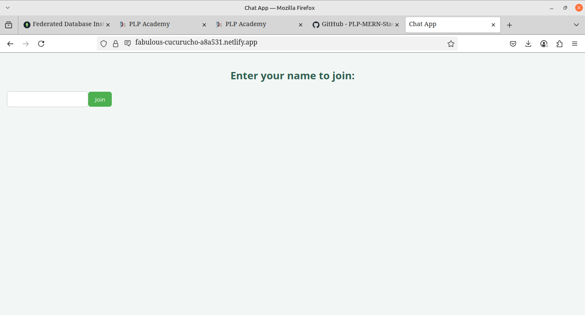
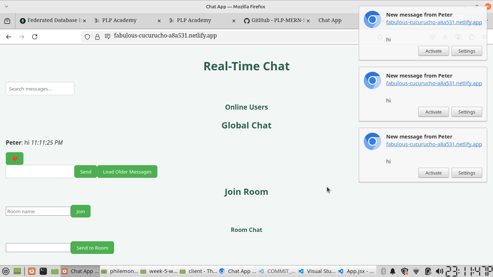

# 💬 Real-Time Chat Application

A real-time full-stack chat application built with **React**, **Node.js**, **Express**, and **Socket.io**, allowing users to chat globally, privately, and in chat rooms with live notifications, message reactions, file sharing, and more.

---

## 🚀 Live Links

- 🌐 **Frontend (Netlify):** [https://fabulous-cucurucho-a8a531.netlify.app](https://fabulous-cucurucho-a8a531.netlify.app)
- 🔗 **Backend (Render):** [https://week-5-web-sockets-assignment-zm9s.onrender.com](https://week-5-web-sockets-assignment-zm9s.onrender.com)

---

## ✨ Features

- ✅ Global chat room
- ✅ Private 1-on-1 messaging
- ✅ Multiple chat rooms/channels
- ✅ Online/offline user status
- ✅ "User is typing..." indicators
- ✅ Real-time notifications (browser + sound)
- ✅ File/image sharing in private chats
- ✅ Read receipts for private messages
- ✅ Reactions (like ❤️, 👍, etc.)
- ✅ Message delivery acknowledgment
- ✅ Message pagination
- ✅ Message search
- ✅ Reconnection support
- ✅ Responsive mobile-friendly design

---

## 📸 Screenshots


### 🔐 Join Screen



### 👥 Private Chat



---

## 🛠️ Technologies Used

### 🔧 Frontend
- React.js (Vite)
- Socket.io Client
- Tailwind CSS

### 🖥️ Backend
- Node.js
- Express.js
- Socket.io
- CORS

---

## 📁 Folder Structure

week-5-web-sockets-assignment-architectPhilemon/
├── client/ # React frontend
│ ├── src/
│ └── public/
├── server/ # Express + Socket.io backend
│ ├── server.js
│ └── package.json
├── screenshots/ # UI screenshots
├── README.md # This file
└── Week5-Assignment.md

yaml
Copy
Edit

---

## 🧑‍💻 Local Setup Instructions

### 1. Clone the Repository

```bash
git clone https://github.com/PLP-MERN-Stack-Development/week-5-web-sockets-assignment-architectPhilemon.git
cd week-5-web-sockets-assignment-architectPhilemon
### 2. Start the Backend
bash
Copy
Edit
cd server
npm install
npm start
Backend will run on http://localhost:5000

###3. Start the Frontend
In a new terminal:

bash
Copy
Edit
cd ../client
npm install
npm run dev
Frontend will run on http://localhost:5173

###🌍 Deployment Details
###🟦 Backend on Render
Hosted at: https://week-5-web-sockets-assignment-zm9s.onrender.com

package.json includes a valid "start" script

Express app.get('/') route returns confirmation message

## Frontend on Netlify
Hosted at: https://fabulous-cucurucho-a8a531.netlify.app

Built with Vite using npm run build

Deployed from client/dist directory